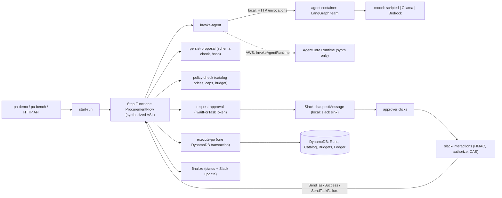

# 🧾 Durable multi-agent workflow

> Human-gated procurement agents. Agents propose a purchase order; Step Functions waits for a signed Slack approval.

200 approval runs with 59 crashes injected after commit, 200 double clicks and a budget race: 0 duplicate or missing purchase orders, $0.00 budget drift, $0.00 overspend (Step Functions Local + DynamoDB Local, 2026-10-04).

<!-- readme-header -->
[](https://github.com/sathwikbairaboina2/durable-multi-agent/actions/workflows/ci.yml)    

| Measured | Source |
|---|---|
| **0 duplicate POs** | `bench/results/latest.json` |
| **$0.00 budget drift** | `bench/results/latest.json` |

A LangGraph agent team proposes a purchase order. A Step Functions workflow waits, at zero compute, for a human to approve it in Slack. A deterministic TypeScript core writes the ledger row exactly once and never over budget.

## 30-second demo

`npm run demo` runs one request end to end on the real synthesized state machine and prints the Slack card. This is a real transcript with the scripted model (`docs/demo/demo-scripted.txt`):

```text
▶ request from <@U0REQUESTER>: "We need 3 more GPU dev boxes for the ML team, under $9k"
  +    7ms  PLANNING
  +  261ms  POLICY
  +  502ms  AWAITING_APPROVAL

┌──────────────────────────────────────────────────────────────┐
│ Purchase order approval                                      │
│                                                              │
│ Requester: @U0REQUESTER                                      │
│ Run: 01M421FEAJZ4P3CYTKJ6Z43JQZ                              │
│                                                              │
│ 3 × GPU dev box (RTX 4090)                         $8,697.00 │
│                                                              │
│ Total $8,697.00 · budget left after this order $6,303.00     │
│                                                              │
│ Requested: We need 3 more GPU dev boxes for the ML team,     │
│ under $9k. Order: 3 x GPU dev box (RTX 4090); total by       │
│ catalog price $8,697.00.                                     │
│                                                              │
│ [ Approve ]  [ Reject ]                                      │
└──────────────────────────────────────────────────────────────┘

✔ <@U0APPROVER1> clicked Approve → "Approved. Placing the order."
  +  778ms  DONE

Outcome: DONE
  PO#01M421FEAJZ4P3CYTKJ6Z43JQZ $8,697.00 approved by U0APPROVER1
  budget left this month: $6,303.00
  agent model: scripted, 3 model steps, 709 input / 86 output tokens
  total elapsed: 6.9 s (approval reply: "Approved. Placing the order.")
```

## What it proves

- **The model proposes, the core disposes.** The agent only returns a `ProposedOrder`. Prices, caps, budgets, approvers and status changes are decided by plain TypeScript in `src/core`, which has no AWS imports.
- **A human gate that survives retries.** The workflow stores a task token under an opaque approval id. A signed Slack click decides it once. Duplicate clicks, late clicks and replayed tokens change nothing.
- **Exactly-once money.** One DynamoDB transaction checks the approval and its proposal hash, writes the ledger row, charges the budget and marks the run done. A retry after a crash reads the row back instead of charging twice.

## Architecture



Locally, Step Functions Local runs the exact definition string from the synthesized CloudFormation template. Its Lambda calls go to an in-process Lambda host that runs the same handler code the CDK app bundles.

## Invariants and the tests that prove them

| # | Invariant | Test |
|---|---|---|
| I1 | No ledger write unless the approval is APPROVED for the executed proposal hash | [execute.test.ts](test/unit/core/execute.test.ts), [approval-binding.test.ts](test/integration/approval-binding.test.ts) |
| I2 | Totals come from catalog prices only | [policy.property.test.ts](test/unit/core/policy.property.test.ts) |
| I3 | Spend never exceeds the limit under concurrency | [budget-race.test.ts](test/integration/budget-race.test.ts) |
| I4 | At most one ledger row per run; retries never double-charge | [duplicate-resume.test.ts](test/integration/duplicate-resume.test.ts) |
| I5 | No self-approval; only listed approvers | [authorize.test.ts](test/unit/core/authorize.test.ts) |
| I6 | Stale or tampered Slack requests are rejected before any state change | [slack-verify.test.ts](test/unit/core/slack-verify.test.ts), [slack-interactions.test.ts](test/unit/handlers/slack-interactions.test.ts) |
| I7 | An approval decides once | [double-click.test.ts](test/integration/double-click.test.ts) |
| I8 | The approval wait is bounded, then expires without executing | [flow.test.ts](infra/test/flow.test.ts), [flow.test.ts](test/integration/flow.test.ts) |
| I9 | Schema-invalid agent output never reaches policy or Slack | [schema.test.ts](test/unit/core/schema.test.ts), [persist-proposal.test.ts](test/unit/handlers/persist-proposal.test.ts) |
| I10 | At most 12 graph steps and 40k output tokens per run | [test_budget.py](agent/tests/test_budget.py) |
| I11 | The task token never appears in a Slack body or a log line | [request-approval.test.ts](test/unit/handlers/request-approval.test.ts) |
| I12 | Only invoke-agent may call the agent runtime; only execute-po may write the ledger | [iam.test.ts](infra/test/iam.test.ts) |

## Results

Chaos benchmark (`npm run bench`, `bench/results/latest.json`). Run counts per status vary a little between runs because clicks are concurrent. The three invariant rows are what the benchmark checks.

| Metric | Value |
|---|---|
| Runs | 200 |
| Final statuses | {"DONE": 141, "REJECTED_BY_HUMAN": 8, "FAILED": 51} |
| Failure reasons | {"BUDGET_EXHAUSTED": 51} |
| Crashes injected after the ledger commit | 59 |
| Double clicks / approve-vs-reject clicks | 179 / 21 |
| Ledger rows | 141 |
| Ledger/status mismatches | 0 |
| Budget drift (cents) | 0 |
| Overspend (cents) | 0 |
| Approval click to ledger row, p50 / p95 (ms, local) | 1149 / 1417 |
| State transitions per run (median, min, max) | 8, 6, 8 |
| Orchestration cost per run (USD, estimate: transitions x $0.000025) | 0.0002 |
| Wall clock (s) | 38.8 |

Local latencies are not AWS latencies. The cost row is a price times a measured transition count, so it is an estimate.

Agent eval (30 requests, `agent/evals/run.py`): **not run**. The host Ollama server did not answer in time while this was built. The scripted model is a test stand-in and is not scored.

## Quickstart

```bash
npm ci
npm run local:up                      # DynamoDB Local on 5330, Step Functions Local on 5332
docker compose up -d --build agent    # the agent container on 5333 (scripted model by default)
npm run demo                          # one approval, end to end
npm run bench                         # the chaos benchmark (200 runs)
npm run local:down
```

Tests: `npm test` (no Docker), `npm run test:integration` (needs `npm run local:up`), `cd agent && uv sync --frozen && uv run pytest -q`, `npm run synth` (CDK synth with cdk-nag).

## Install the harness

`packages/sfn-local-harness` runs the state machine your CDK app synthesizes on Step Functions Local, with your Lambda handlers in-process. See [its README](packages/sfn-local-harness/README.md).

## What is not proven

- Nothing was deployed to AWS. AgentCore, Bedrock, KMS and the HTTP API are covered by unit tests and `cdk synth` only.
- Step Functions Local is an old, unsupported image. It has no JSONata, no redrive and no IAM evaluation ([ADR 0001](docs/adr/0001-local-aws-without-localstack.md)).
- Crashes are injected at the Lambda boundary after the handler returns. That proves the retry path, not partial-write recovery.
- The scripted model is a test stand-in. No model-quality number is claimed unless the eval section above shows one.

## Roadmap v0.2

The Lambda durable-functions variant with a measured cost comparison, the AgentStack on the ServerlessAgent construct, a reject-and-revise loop, and an AWS deploy guide. See [ADR 0007](docs/adr/0007-scope-sfn-first-durable-later.md).

## Decisions

[0001 local AWS without LocalStack](docs/adr/0001-local-aws-without-localstack.md) ·
[0002 run the synthesized ASL locally](docs/adr/0002-run-the-synthesized-asl-locally.md) ·
[0003 deterministic core owns money and status](docs/adr/0003-deterministic-core-owns-money-and-status.md) ·
[0004 task token and opaque approval id](docs/adr/0004-approval-with-task-token-and-opaque-id.md) ·
[0005 agent team behind the AgentCore contract](docs/adr/0005-agent-team-behind-agentcore-contract.md) ·
[0006 model selection](docs/adr/0006-model-selection.md) ·
[0007 scope](docs/adr/0007-scope-sfn-first-durable-later.md) ·
[0008 chaos benchmark](docs/adr/0008-chaos-benchmark-methodology.md)

Developer guide: [docs/DEVDOCS.md](docs/DEVDOCS.md). License: MIT.
