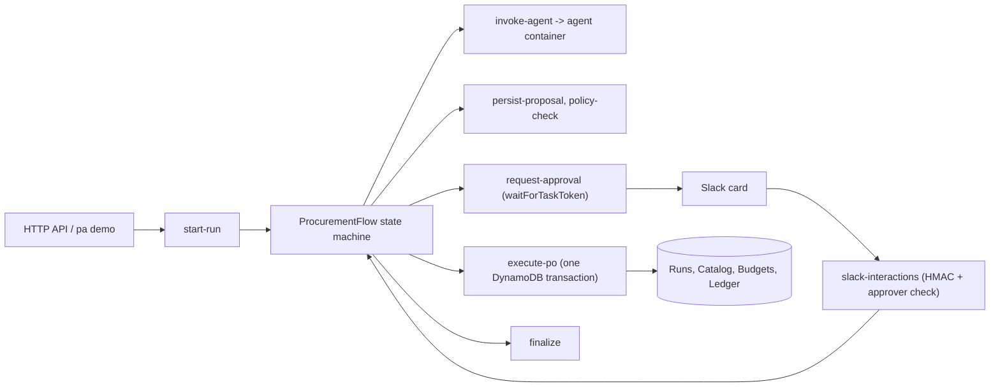

# Developer guide

## 1. What it is

A human-gated procurement workflow. A LangGraph agent team proposes a purchase order. Step Functions waits for a signed Slack approval. A TypeScript core writes the ledger row exactly once and never over budget.

Measured headline (from `bench/results/latest.json`): 200 approval runs with 59 crashes injected after commit, 200 double clicks and a budget race: 0 duplicate or missing purchase orders, $0.00 budget drift, $0.00 overspend (Step Functions Local + DynamoDB Local, 2026-10-04).

## 2. Quickstart (5 minutes)

You need Node 24, Docker, and uv.

```bash
npm ci
npm run local:up                      # DynamoDB Local :5330, Step Functions Local :5332
docker compose up -d --build agent    # agent container :5333 (scripted model)
npm run demo                          # one approval end to end
npm run local:down
```

## 3. Architecture



The CDK app has one stack. Locally, `sfn-local-harness` takes the synthesized template, creates the tables in DynamoDB Local, deploys the state machine to Step Functions Local, and serves the handlers from an in-process Lambda host on port 5331.

## 4. Project layout

| Path | What is there |
|---|---|
| `src/core` | Pure logic: hash, schema, policy, status machine, authorization, Slack signing and messages, execution planning. No AWS imports. |
| `src/adapters` | DynamoDB repositories, Step Functions, Slack and agent clients, secrets, logging. |
| `src/handlers` | Nine Lambda handlers, each a factory plus `fromEnv`. |
| `src/local` | Local environment, Slack sink, seed data, test driver. |
| `infra` | CDK app: Data, Flow and Api constructs, cdk-nag acknowledgements, CDK tests. |
| `packages/sfn-local-harness` | The installable package: intrinsic resolver, stack loader, Lambda host, deployers. |
| `agent` | Python LangGraph team, AgentCore HTTP app, eval set and runner. |
| `cli`, `bench` | `pa demo`, `pa bench`, the chaos benchmark and the headline generator. |
| `test` | Unit, property and integration tests. |
| `docs` | Spec, ADRs, plan, demo transcript, handoff. |

## 5. Run, test and benchmark

| Task | Command |
|---|---|
| Typecheck | `npm run typecheck` |
| Unit, property and CDK tests (no Docker) | `npm test` |
| CDK synth with cdk-nag | `npm run synth` |
| Integration tests | `npm run local:up && npm run test:integration && npm run local:down` |
| Benchmark | `npm run local:up && npm run bench -- --runs 200 && npm run local:down` |
| Print the headline | `npm run bench:headline` |
| Agent tests | `cd agent && uv sync --frozen && uv run pytest -q` |
| Agent eval (needs Ollama) | `cd agent && uv run python evals/run.py --model ollama` |
| Lint the workflow | `docker run --rm -v "$PWD:/repo" -w /repo rhysd/actionlint:1.7.12` |

Ports used: 5330 DynamoDB Local, 5331 Lambda host, 5332 Step Functions Local, 5333 agent, 5334 Slack sink.

## 6. Key decisions and what they gave up

| Decision | Gave up |
|---|---|
| [No LocalStack; run the synthesized ASL on Step Functions Local](adr/0001-local-aws-without-localstack.md) | IAM, JSONata and redrive parity locally |
| [One stack, handlers in-process](adr/0002-run-the-synthesized-asl-locally.md) | Independent stack deploys |
| [Deterministic core owns money and status](adr/0003-deterministic-core-owns-money-and-status.md) | Letting the model negotiate or price |
| [Task token behind an opaque approval id](adr/0004-approval-with-task-token-and-opaque-id.md) | A second write between the click and the resume |
| [Agent team behind the AgentCore HTTP contract](adr/0005-agent-team-behind-agentcore-contract.md) | Real AgentCore runs in v0.1 |
| [Scripted model by default](adr/0006-model-selection.md) | A quality number from the default model |
| [Step Functions first, durable functions later](adr/0007-scope-sfn-first-durable-later.md) | The cost comparison |
| [Chaos benchmark as the headline](adr/0008-chaos-benchmark-methodology.md) | AWS latency numbers |

## 7. Known limits and what is left

- Nothing is deployed to AWS. AgentCore, Bedrock, KMS and the HTTP API are covered by unit tests and `cdk synth` only.
- If `SendTaskSuccess` fails after the approval is marked APPROVED, the workflow waits until its timeout. `SendTaskSuccess` is retried 3 times; the gap is documented, not closed.
- Crash injection is at the Lambda boundary. It proves the retry path, not partial-write recovery.
- The Ollama eval and demo were not completed on this host; see the README results section for the current state.
- v0.2: the durable-functions variant and cost comparison, the ServerlessAgent AgentStack, a reject-and-revise loop, an AWS deploy guide.
