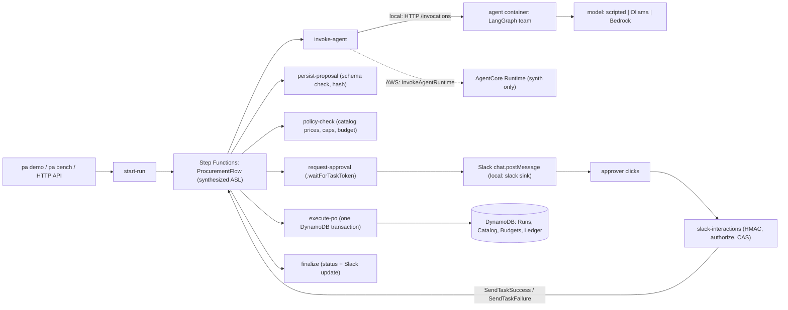

# Durable multi-agent workflow v0.1: spec

Date: 2026-10-04. Author: Claude (Opus lead). Status: accepted for build.
Design source: `taskarinchu/docs/devdocs/durable-multi-agent.md` (the full design). This spec narrows it to what v0.1 ships on this machine, and says why.

## One line

A LangGraph agent team proposes a purchase order; a Step Functions workflow waits (at zero compute) for a human to approve it in Slack; a deterministic core writes it to a ledger exactly once and never over budget. v0.1 proves the "exactly once, never over budget" claim with a measured chaos benchmark against the real synthesized state machine.

## What v0.1 must deliver (portfolio bar)

| Bar | v0.1 answer |
|---|---|
| 30-second wow | `npm run demo`: one command runs a request through the agent team, prints the Slack approval card, approves it with a signed Slack payload, and prints the ledger row. The README shows a captured transcript of a real run. |
| Measured headline number | `npm run bench`: N runs through the real ASL on Step Functions Local with crashes injected after commit, duplicate clicks and a budget race. The README headline line is copied from `bench/results/latest.json` (for example "0 duplicate POs and 0 cents of budget drift across 200 runs with 60 injected crashes"). No number is written before it is measured. |
| Something installable | `sfn-local-harness` (npm workspace package): run the exact state machine your CDK app synthesizes on Step Functions Local, with your Lambda handlers in-process. `npm pack --dry-run` is a gate. |
| Honest ADRs | `docs/adr/0001`-`0008`, each with "what we gave up". |
| CI with tests | GitHub Actions: typecheck, unit/property/CDK tests, `cdk synth` with cdk-nag, pytest, and the integration suite + a short benchmark against DynamoDB Local and Step Functions Local service containers. |

## Hard constraints of this machine (checked 2026-10-04)

- **No LocalStack token**, and LocalStack 2026.03+ cannot start without one. So LocalStack is not used at all (ADR 0001).
- **No AWS credentials.** Nothing deploys to AWS. AWS-only paths (AgentCore `InvokeAgentRuntime`, Bedrock, KMS, HTTP API) are covered by unit tests with `aws-sdk-client-mock` and by `cdk synth` + `Template` assertions only, and the docs say so.
- Docker Desktop works. `amazon/dynamodb-local:3.3.1` and `amazon/aws-stepfunctions-local:2.0.0` were prototyped on this host (results in ADR 0001).
- Ollama on the host serves `qwen3.8:27b`. A warm JSON-mode call took 11.1 s; a cold one 123 s. The default model is therefore a scripted fake; Ollama is opt-in.
- Host ports 5330-5339 only. Docker names start with `durable-multi-agent-`.

## Scope

### In v0.1
- `src/core/`: pure TypeScript, no AWS SDK imports: canonical hash, ProposedOrder schema, policy pricing, status machine, approver authorization, Slack signature verification, Slack message builder, execution planning.
- `src/adapters/`: DynamoDB repositories (transactions, conditional writes), Slack Web API client (base URL configurable), Step Functions resumer, agent clients (HTTP for local, AgentCore SDK for AWS).
- `src/handlers/`: nine Lambda handlers, each a factory `make<Name>Handler(deps)` plus `fromEnv(env)`.
- `infra/`: CDK v2 app with one stack, `DurableMultiAgentStack`, built from the `Data`, `Flow` and `Api` constructs (one template, no cross-stack imports; ADR 0002). cdk-nag `AwsSolutionsChecks` runs on synth.
- `packages/sfn-local-harness/`: CloudFormation intrinsic resolver, stack loader, Lambda Invoke API host, table/state-machine deployers.
- `src/local/`: local environment bootstrap (deploys the synthesized template to DynamoDB Local + SFN Local), Slack sink recorder.
- `agent/`: Python 3.12 LangGraph team (intake, sourcing, justification) behind the AgentCore HTTP contract (`bedrock-agentcore` SDK), model factory `scripted | ollama | bedrock`, step and token budgets.
- `cli/pa.ts`: `pa demo`, `pa bench`.
- `bench/`: chaos benchmark and committed results.
- `agent/evals/`: 30-request eval set and runner (run against Ollama if reachable).
- CI workflow, README, DEVDOCS, handoff.

### Deferred to v0.2 (ADR 0007)
- Variant B on Lambda durable functions (`@aws/durable-execution-sdk-js` 2.6.0 exists on npm) and `pa compare`. Its cost comparison needs real AWS billing data, which this machine cannot produce.
- `AgentStack` via the ServerlessAgent construct (that repo has no commits yet, so it cannot be consumed).
- Reject-and-revise loop with a Slack modal (v0.1 rejection is terminal: `REJECTED_BY_HUMAN`).
- Real Slack app manifest and AWS deploy guide.
- Field-level KMS encryption of the task token (v0.1 uses a customer-managed KMS key on the whole `Runs` table; ADR 0004).

## Architecture (v0.1 as built)

Locally, Step Functions Local runs the exact definition string from the synthesized CloudFormation template. Its Lambda calls go to an in-process Lambda Invoke API host (`sfn-local-harness`) that dispatches to the same handler code the CDK app bundles (ADR 0002).

### State machine `ProcurementFlow`

Input: `{ runId, requesterId, request }`.

| State | Type | Calls | Result path | Errors |
|---|---|---|---|---|
| `InvokeAgentTeam` | Task | `invoke-agent` | `$.agent` | Catch `States.ALL` → `MarkFailed` |
| `PersistProposal` | Task | `persist-proposal` | `$.persist` | Catch `States.ALL` → `MarkFailed` |
| `PolicyCheck` | Task | `policy-check` | `$.policy` | Catch `States.ALL` → `MarkFailed` |
| `PolicyPassed?` | Choice | | | `$.policy.ok == true` → `RequestApproval`, else `MarkRejectedByPolicy` |
| `RequestApproval` | Task `lambda:invoke.waitForTaskToken`, `TimeoutSeconds` = `approvalTimeoutSeconds` (default 172800) | `request-approval` | `$.approval` | Catch `States.Timeout` → `MarkExpired`; Catch `HumanRejected` → `MarkRejectedByHuman`; Catch `States.ALL` → `MarkFailed` |
| `ExecutePO` | Task | `execute-po` | `$.execution` | Retry `ChaosError`, `States.TaskFailed` (not `BudgetExhausted`/`HashMismatch`/`NotApproved`), 3 attempts, 1 s, backoff 2; Catch `BudgetExhausted` / `HashMismatch` / `NotApproved` / `States.ALL` → `MarkFailed` |
| `MarkDone` / `MarkFailed` / `MarkExpired` / `MarkRejectedByPolicy` / `MarkRejectedByHuman` | Task | `finalize` with `{ runId, outcome, error? }` | `$.final` | then `Succeed` (or `Fail` for `MarkFailed`) |

Every Lambda task uses `payloadResponseOnly: true` (the direct-ARN form, proven on SFN Local). Every caught error is stored with `ResultPath: "$.error"` so the original input survives.

## Data model

All tables: on-demand, PITR on, `RemovalPolicy.RETAIN` in the AWS stage. Key attributes are `pk` and `sk` (lowercase) for all tables.

`Runs` (customer-managed KMS key, holds task tokens):

| pk | sk | attributes |
|---|---|---|
| `RUN#<runId>` | `META` | `requesterId`, `request`, `status`, `createdAt`, `updatedAt`, `executionArn?`, `failureReason?`, `slackTs?`, `slackChannel?` |
| `RUN#<runId>` | `PROPOSAL#v1` | `proposal` (map), `proposalHash`, `usage` {inputTokens, outputTokens, modelSteps} |
| `RUN#<runId>` | `APPROVAL` | `approvalId`, `taskToken`, `proposalHash`, `totalCents`, `pricedLines`, `state` (`PENDING`/`APPROVED`/`REJECTED`/`EXPIRED`), `decidedBy?`, `decidedAt?`, `ttl` |
| `APPROVAL#<approvalId>` | `LOOKUP` | `runId` |

`Catalog`: pk `SKU#<sku>`, sk `ITEM`: `sku`, `name`, `vendor`, `unitPriceCents`, `maxQtyPerOrder`, `active`.
`Budgets`: pk `REQ#<requesterId>`, sk `MONTH#<yyyy-mm>`: `limitCents`, `spentCents`.
`Ledger`: pk `PO#<runId>`, sk `PO`: `runId`, `requesterId`, `lines`, `totalCents`, `approvedBy`, `proposalHash`, `createdAt`.

Money is integer cents everywhere. `ProposedOrder` follows the design's JSON Schema (draft 2020-12): `runId` (ULID pattern), `currency` const `USD`, 1-10 `lines` of `{sku, qty 1-50, claimedUnitPriceCents?}`, `justification` ≤ 2000 chars, no extra properties.

Status machine for `META.status`: `PLANNING → POLICY → AWAITING_APPROVAL → EXECUTING → DONE`; terminal branches `REJECTED_BY_POLICY` (from `POLICY`), `REJECTED_BY_HUMAN` and `EXPIRED` (from `AWAITING_APPROVAL`), `FAILED` (from any non-terminal state). Terminal states are absorbing. Every transition is a conditional update on the expected prior status.

DynamoDB condition expressions cannot do arithmetic, so the budget check is: read `limitCents`, compute `maxSpentBefore = limitCents - totalCents` in code, and condition the update on `limitCents = :lim AND spentCents <= :maxSpentBefore` (prototyped: 20 concurrent transactions against a budget that fits 7 gave exactly 7 commits).

## Key flows

1. **Happy path.** `start-run` writes `META(PLANNING)` and calls `StartExecution(name = runId)`. The agent returns a `ProposedOrder`. `persist-proposal` validates it (I9), stores it with its hash, moves to `POLICY`. `policy-check` prices it from the catalog (I2) and checks caps and budget. `request-approval` stores the task token under a fresh `approvalId`, moves to `AWAITING_APPROVAL`, posts the card (buttons carry only `approvalId`, I11). The approver clicks Approve; `slack-interactions` verifies the HMAC (I6), authorizes (I5), CAS-updates the approval to `APPROVED` (I7) and calls `SendTaskSuccess`. `execute-po` moves to `EXECUTING`, then one transaction: condition-check the approval (`APPROVED` and same hash, I1), put the ledger row (`attribute_not_exists`, I4), add to `spentCents` under the budget condition (I3), set `DONE`. `finalize` updates the Slack message.
2. **Retry after commit.** If `execute-po` crashes after the transaction committed, SFN retries; the transaction now cancels on the ledger condition, and the handler reads back the existing ledger row and returns `{ alreadyExecuted: true }` when its `proposalHash` matches. Budget is not charged twice (I4).
3. **Rejection.** Reject → CAS to `REJECTED` → `SendTaskFailure(error = "HumanRejected")` → `MarkRejectedByHuman`.
4. **Expiry.** No click before `TimeoutSeconds` → `States.Timeout` → `MarkExpired` CAS-updates the approval `PENDING → EXPIRED`. A late click gets an ephemeral "this request expired" reply and changes nothing.
5. **Budget race.** Concurrent approved runs whose total exceeds the budget: the losers' transactions cancel on the budget condition → `BudgetExhausted` → `MarkFailed` with `failureReason = "BUDGET_EXHAUSTED"`.

## Invariants and where they are proven

| # | Invariant | Proving test (task) | Runs in |
|---|---|---|---|
| I1 | No ledger write unless the approval is `APPROVED` with the executed proposal's hash | `test/unit/core/execute.test.ts`; `test/integration/approval-binding.test.ts` (T18) | unit + integration |
| I2 | Totals come from catalog prices only | `test/unit/core/policy.property.test.ts` (T3) | unit |
| I3 | Spend never exceeds the limit under concurrency | `test/integration/budget-race.test.ts` (T18) + bench | integration |
| I4 | At most one ledger row per run; retries never double-charge | `test/integration/duplicate-resume.test.ts` (T18) + bench | integration |
| I5 | No self-approval; only listed approvers | `test/unit/core/authorize.test.ts` (T4) | unit |
| I6 | Stale (> 300 s) or tampered Slack requests rejected before any state change | `test/unit/core/slack-verify.test.ts` (T5), handler test (T9) | unit |
| I7 | An approval decides once | `test/integration/double-click.test.ts` (T18) | integration |
| I8 | Approval wait is bounded, then expires without executing | `infra/test/flow-stack.test.ts` (T12); `test/integration/flow.test.ts` expiry case (T17) | unit + integration |
| I9 | Schema-invalid agent output never reaches policy or Slack | `test/unit/core/schema.test.ts` (T2), `persist-proposal` handler test (T8) | unit |
| I10 | ≤ 12 graph steps and ≤ 40k output tokens per run | `agent/tests/test_budget.py` (T20) | pytest |
| I11 | The task token never appears in a Slack body or a log line | `test/unit/handlers/request-approval.test.ts` (T9) | unit |
| I12 | Only `invoke-agent` may call the agent runtime; only `execute-po` may write `Ledger` | `infra/test/iam.test.ts` (T13) | unit |

## Metrics

| Metric | Source | Label in docs |
|---|---|---|
| Duplicate ledger rows, budget drift (`spentCents − Σ ledger`), overspend, runs whose ledger state disagrees with their final status | `bench/results/latest.json` | measured (SFN Local + DynamoDB Local) |
| Approval-click → ledger-row latency p50/p95 | bench | measured locally; not an AWS latency |
| State transitions per run (from execution history) and the orchestration cost they imply at the published Step Functions Standard price | bench | **estimate** (price × measured transition count) |
| Agent line-item exact match on 30 requests | `agent/evals/results/latest.json` | measured on Ollama `qwen3.8:27b`, or "not run" |

## Risks

- **Step Functions Local is frozen** (last image May 2024, no JSONata, unsupported by AWS). Mitigation: the flow uses only JSONPath features that the prototype ran; the ASL is also asserted with CDK `Template` tests; ADR 0001 states the gap.
- **SFN Local starts slowly** (socket hang-ups for the first ~10 s). The harness polls `ListStateMachines` until it answers.
- **SFN Local task tokens are 36-char UUIDs**, unlike real tokens (up to 1024 chars). Code must not assume a length.
- **Ollama latency** (11 s per warm call): the demo defaults to the scripted model; the eval is optional.
- **CAS-then-SendTaskSuccess is two steps.** If `SendTaskSuccess` fails after the CAS, the approval says `APPROVED` but the workflow waits until timeout. v0.1 retries `SendTaskSuccess` 3 times and documents the gap.
